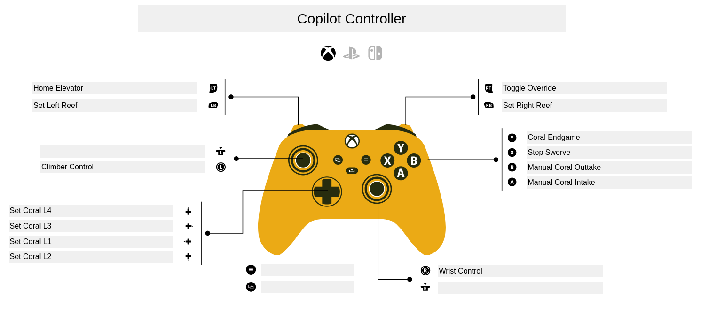

# Team 3648 2025 Reefscape
This is Team 3648's robotics framework for the FIRST 2025 Reefscape competition.

## Prerequisites:
In order to build and run the robot code, you'll need the following:
- [Java Development Kit](https://www.oracle.com/java/technologies/downloads/) (JDK) v11 or higher
- WPILib [v2025.1.1](https://github.com/wpilibsuite/allwpilib/releases/tag/v2025.1.1) or latest
- [FRC Game Tools](https://www.ni.com/en/support/downloads/drivers/download.frc-game-tools.html#553883)
- [PathPlanner](https://github.com/mjansen4857/pathplanner/releases/tag/v2025.1.1)

## References
### Local IPs

These can be used to access their respective component's web interfaces, or for SSH. Make sure you are connected to the robot's access point before trying these. \
*`##.##` should be replaced with the robot's team number (e.g. `10.36.48.2`).*
- **RoboRIO:** `10.##.##.2` 
    - *SSH:* `$ ssh admin@10.##.##.2` for the root user, or `$ ssh lvuser@10.##.##.2` for the live user (the user the code runs out of).
        - *If you get a key verification error after changing the radio team number, delete your ssh `knownhosts` file.*
- **Limelights:** `10.##.##.20` & `10.##.##.19`
- **Radio:** `10.##.##.1`
### Reefscape Pose Generator - Desmos
Use this tool to generate poses around the center of a reef given an inital working pose.
[Desmos Reefscape Tool](https://www.desmos.com/calculator/ipvnamkwov)
### Advantage Scope Configuration
* To simulate the 3648 2025 CompBot on the 3D field, go to _assets/advantageScope/_, copy the userAssets.7z, and exctract it to the local hardrive. Then, open Advantage Scope, press **Help &#8594; Use Custom Assets Folder**, and then select the unzipped userAssets. 
* To open custom premade layouts, go to **File &#8594; Import Layout...** and select the layout you want from _assets/advantageScope/Layouts_.
* You can open logs by selecting **File &#8594; Open Log(s)...**, and then selecting on a log file in _assets/advantageScope/UtahLogs_

### Control Schemes:

*Driver Controller* \
 \
*Copilot Controller* 

### Vendor JSONs:
- [REVLib](https://software-metadata.revrobotics.com/REVLib-2025.json)
- [AdvantageKit](https://github.com/Mechanical-Advantage/AdvantageKit/releases/latest/download/AdvantageKit.json)
- [PathPlanner](https://3015rangerrobotics.github.io/pathplannerlib/PathplannerLib.json)
- [Phoenix](https://maven.ctr-electronics.com/release/)
- [Studica](https://dev.studica.com/releases/2025/Studica-2025.0.0.json)
- [UCRL](https://raw.githubusercontent.com/Mechanical-Advantage/URCL/maven/URCL.json)

## Best Practices:
- For the proper functioning of swerve, it is best practice to recalibrate the NavX Gyro. To do this, go to the board, hold down the CAL button for 5 seconds, and then hold the RES button for another 5.

## References
### Local IPs
*`##.##`* should be replaced with the robot's team number (e.g. `10.36.48`). \
**RoboRIO:** `10.##.##.2` \
**Limelight 3:** `http://limelight-three.local:5801` \
**Limelight 2+:** `http://limelight-twoplus.local:5801` \
**Radio:** `10.##.##.1`
### lime light config images
 \
 \
 \
 \
